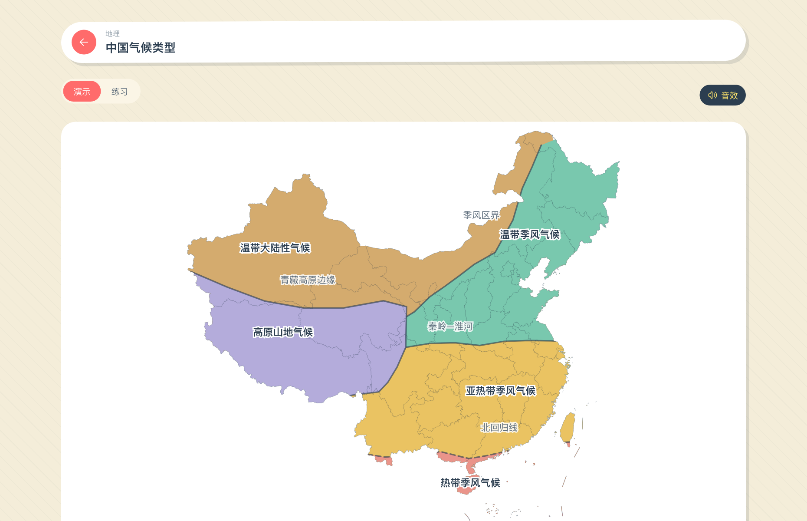
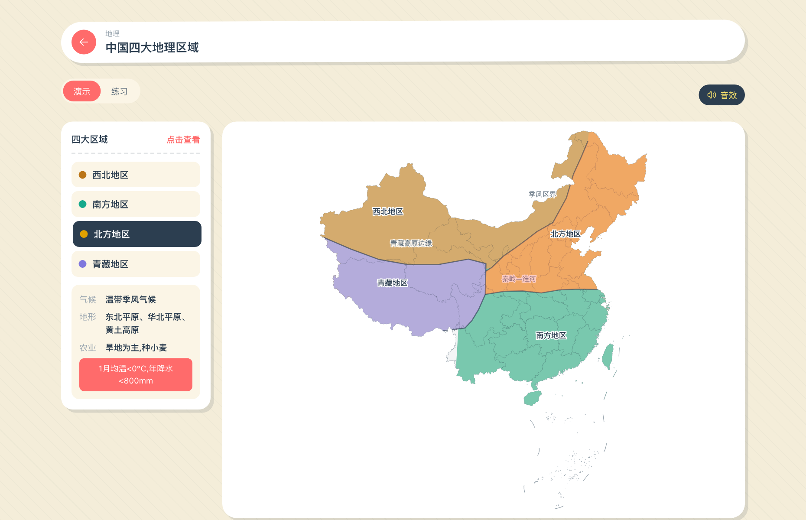
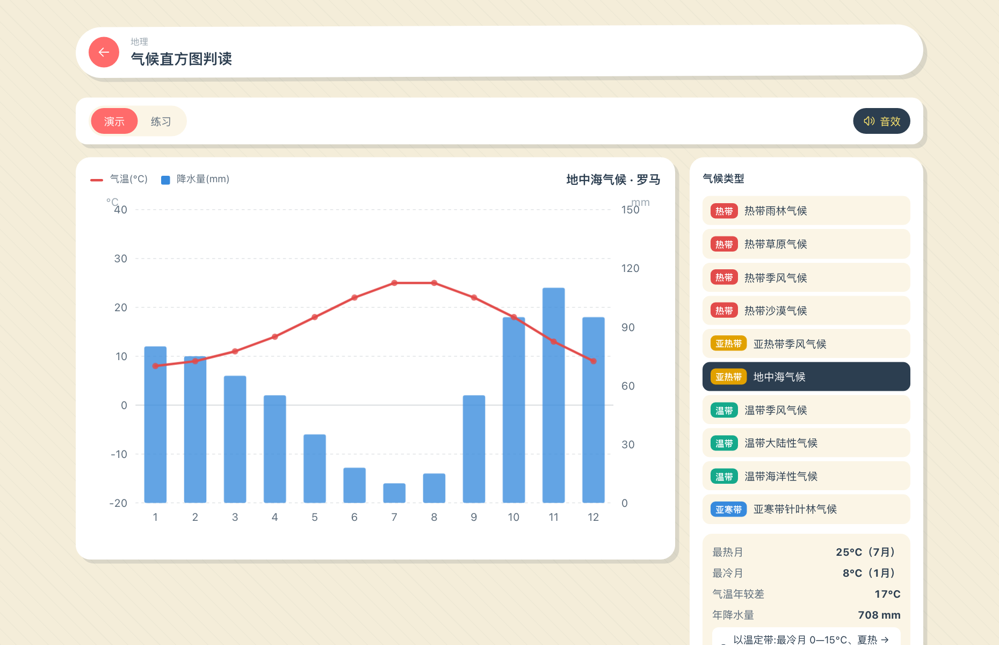
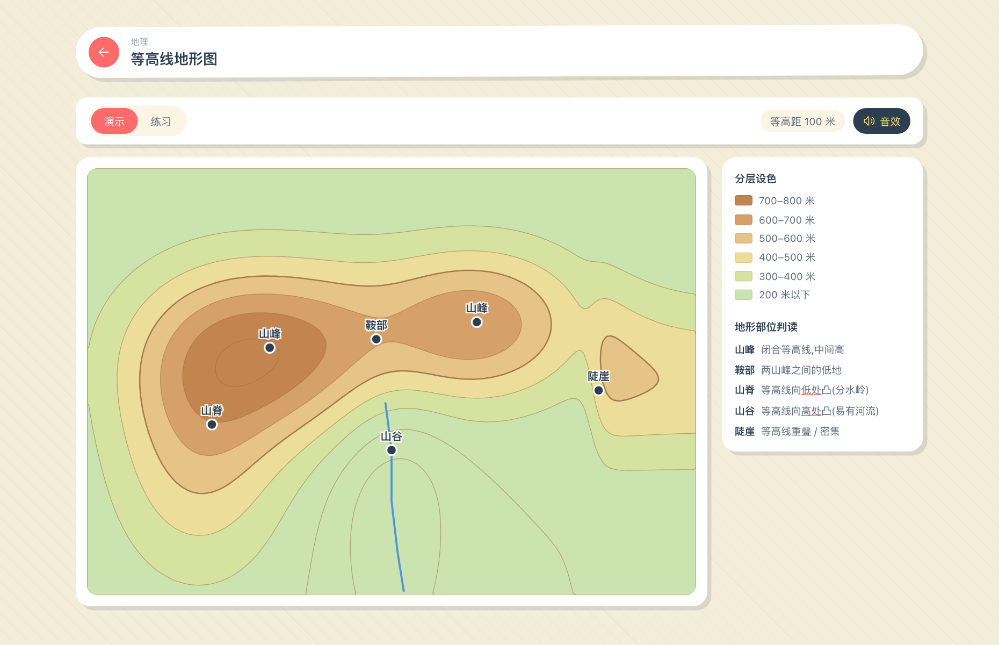
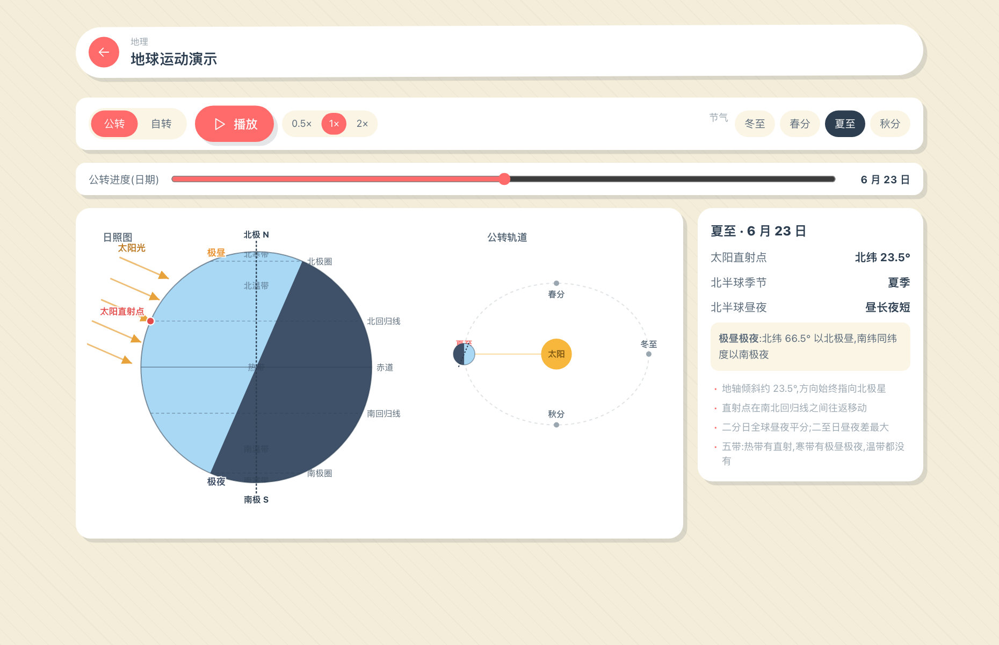

<div align="center">


# HyperClass · 课堂工具箱

**给中小学老师的课堂互动工具箱** —— 大屏演示、学生上台动手,一个工具箱搞定点名、计分、计时、地理演练……

[](https://github.com/ExBook/HyperClass/releases)
[](#-三端同源一套代码三种用法)
[](#-技术栈)
[](LICENSE)


</div>

---

## ✨ 这是什么

HyperClass 是一个**课堂工具箱**:把老师日常上课要用的小工具(随机点名、小组计分、计时器、地图演练、函数图像……)集中到一个干净、好看、可大屏演示的应用里。学生可以上台亲自操作,老师在旁讲解。

- 🎯 **为真实课堂设计**:大字号、强反馈、动画 + 音效,坐在最后一排也看得清。
- 🧩 **演示 + 练习双模式**:很多工具既能"老师演示讲解",又能"出题让学生练习并批改"。
- 🪶 **统一的手作剪纸视觉**:暖色纸面、硬阴影、微旋转,既亲切又不花哨;支持日光 / 月夜主题。
- 📦 **三端同源**:同一套代码,可作为网页、桌面软件、浏览器扩展使用。
- ✈️ **离线可用**:工具内置,无需联网即可上课。

> 适用人群:中小学各学科老师 · 目前内置 **16 个工具**,覆盖**通用 / 地理 / 数学**,持续增加中。

---

## 🌟 核心特性

### 1. 每个工具都"够细腻"
不是把功能堆上去就完事。每个工具都尽量做到:**多种输入/输出方式 · 动画 · 音效 · 过程感 · 人性化交互**。例如:

- **幸运转盘**:旋转抽取,经过扇区时"滴答"减速、落定奏鸣,有悬念。
- **小组计分板**:计分卡保持固定位置(老师靠位置找组),右侧**排行榜**按分数实时排序、换位有平滑动画;最多支持 **64 个小组**。
- **噪音检测仪**:调用麦克风实时显示音量仪表,超过阈值持续一会儿就变红提醒,帮老师控场。

### 2. 演示 + 练习,讲完就能练
地理类工具大多内置两种模式:

- **演示**:展示完整答案 / 动画,老师边演示边讲。
- **练习**:出题、拖放或选择作答、**批量批改**,练习态**不泄露答案颜色**(防"看色作弊")。

### 3. 注重学科正确性
地理与数学工具在物理 / 地理细节上力求严谨,可直接当板书用。例如**地球运动**工具:

- **公转**:大幅日照图,太阳直射点精确落在回归线 / 赤道,晨昏线随季节倾斜,正确呈现**极昼 / 极夜 / 五带**。
- **自转**:北极上空俯视图,昼 / 夜半球、晨昏线、地方时,并且**随季节变化**(夏至北极圈极昼、冬至极夜)。

### 4. 找不到想要的工具?一键反馈
首页、各学科工具架底部都有"没有你想要的工具?"入口,可一键复制邮箱或发邮件,把需求告诉开发者。

---

## 🧰 工具清单(16)

### 通用 · 8
| 工具 | 说明 |
| --- | --- |
| 随机点名 | 从名单里随机抽取学生,支持不重复 |
| 随机分组 | 把学生随机分成若干组,洗牌动画 |
| 小组计分板 | 小组加减分 + 实时排行榜,撤销 / 清零,**最多 64 组** |
| 抽题盒 | 从题目 / 条目里随机翻一张,翻牌动画 |
| 计时器 | 倒计时 / 正计时,大屏圆环 + 响铃 |
| 幸运转盘 | 旋转抽取,减速滴答 + 悬念揭晓 |
| 骰子 | 1–6 颗,面数 6/8/10/12/20,翻滚动画 + 合计 |
| 噪音检测仪 | 麦克风实时音量,仪表 + 超阈值提醒 |

### 地理 · 7(初中为主)
| 工具 | 说明 |
| --- | --- |
| 中国省级行政区 | 把省份拖到地图正确位置;演示 / 练习 |
| 经纬网定位 | 经纬度读图与定位;演示读数 / 练习按坐标定位 |
| 中国气候类型 | 真实气候带 + 分界线;拖放判断;演示 / 练习 |
| 气候直方图判读 | 气温曲线 + 降水柱状图,"以温定带、以水定型"判断气候 |
| 中国四大地理区域 | 北方 / 南方 / 西北 / 青藏 + 三条分界线 |
| 等高线地形图 | 识别山峰 / 山脊 / 山谷 / 鞍部 / 陡崖 |
| 地球运动演示 | 公转(四季 / 直射点)+ 自转(昼夜交替 / 地方时) |

### 数学 · 1
| 工具 | 说明 |
| --- | --- |
| 函数图像 | 拖滑杆实时画一次 / 二次函数图像 |

---

## 📸 工具一览

| 小组计分板(含排行榜) | 幸运转盘 |
| :---: | :---: |
|  |  |

| 中国气候类型 | 中国四大地理区域 |
| :---: | :---: |
|  |  |

| 气候直方图判读 | 等高线地形图 |
| :---: | :---: |
|  |  |

<div align="center">

**地球运动演示**(公转日照图 + 轨道)



</div>

---

## 📦 三端同源:一套代码,三种用法

| 形态 | 用途 | 怎么来 |
| --- | --- | --- |
| **桌面软件** | 老师机 / 多媒体讲台,双击即用、离线 | 到 [Releases](https://github.com/ExBook/HyperClass/releases) 下载对应平台安装包 |
| **网页** | 任意有浏览器的设备,免安装 | `npm run build` 后部署 `dist/`(纯静态) |
| **浏览器扩展(MV3)** | 浏览器工具栏一键打开 | `npm run build:ext` 生成 `dist-ext/`,在浏览器「加载已解压的扩展」 |

---

## ⬇️ 下载与安装(老师用)

到 **[Releases](https://github.com/ExBook/HyperClass/releases)** 下载对应平台的安装包:

- **Windows**:`*_x64-setup.exe` 或 `*_x64_en-US.msi`
- **macOS(Apple 芯片)**:`*_aarch64.dmg`;**macOS(Intel)**:`*_x64.dmg`
- **Linux**:`*.AppImage` 或 `*.deb`

> 安装包暂未做代码签名,首次打开如被系统拦截:**macOS** 右键 →「打开」;**Windows** 选「更多信息 → 仍要运行」。

---

## 🛠 本地开发

```bash
# 环境:Node 20+，桌面构建另需 Rust 工具链
npm install

npm run dev          # 启动网页开发服务器
npm run build        # 构建网页(dist/)
npm run build:ext    # 构建浏览器扩展(dist-ext/)
npm run tauri:dev    # 桌面应用开发
npm run tauri:build  # 打包当前平台桌面安装包
```

### 新增一个工具
1. 在 `src/tools/<学科>/<工具名>/` 下新建 `manifest.ts`(工具元信息)和组件文件。
2. 在 `src/tools/registry.ts` 里 import 该 manifest 并加进 `tools` 数组。

工具通过 manifest 的 `entry` 懒加载、按需分包,注册即上架。

---

## 🧱 技术栈

- **Vite 8 · React 19 · TypeScript 6**,HashRouter 路由
- **Tauri 2**(Rust)打包桌面应用 · MV3 manifest 打包浏览器扩展
- **d3-geo / d3-contour** 处理地图投影与等高线
- 主题用 CSS 变量 + `data-theme` 切换日光 / 月夜
- Web Audio API 做音效,SpeechSynthesis 做朗读
- 自动构建:GitHub Actions(`.github/workflows/`)在打 `v*` 标签时为四个平台构建并发布

---

## 💌 反馈与共建

**没有你想要的工具?** 把需求(年级 / 学科 / 想要的演示或练习方式)告诉我们,我们来做:

📮 **hyperclass@163.com**

也欢迎提 Issue / PR。

---

## 📄 许可

[MIT](LICENSE) © HyperClass
